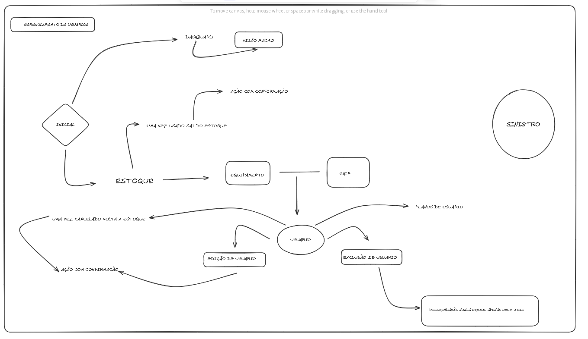

# 📦 Sistema de Gestão de Estoque - Documentação Técnica

## 🐞 Bugs Conhecidos

- **Criação de Estoque**:
  - Tipos de dados e quantidades precisam ser padronizados.
  - Botões deveriam funcionar no modo **toggle**, mas não estão.

- **Modais**:
  - Botão de fechar está bugado em alguns modais.

- **Tela de Dashboard**:
  - Botão de seleção de datas sem estilo.
  - Gráfico sobrepondo elementos da tela.

- **Tela de Clientes**:
  - Aba “Ativos” está importando dados sem aplicar estilos adequados.

- **Tela de Estoque**:
  - Exclusão de estoque não permite escolher o tipo de MEI.

- **Tela de Cadastro de Usuário**:
  - Modal de edição apresenta falha na seleção da linha.

---

## ❓ Dúvidas

- Como devo registrar **equipamentos perdidos**? Alguma tela ou fluxo específico?

- O **modal da tela de Sinistro** já foi implementado?

---

## 🚀 Features Planejadas

- Exportação completa do banco de dados.

---

## 🔒 LGPD e Segurança

- ✅ Autenticação de login via **JWT** implementada.
- ✅ Informações dos clientes armazenadas **sem dados sensíveis ou senhas em risco**.

---

## 🖼️ Imagem Ilustrativa do Projeto

<!-- Substitua o caminho abaixo com a URL ou o nome do arquivo da imagem -->

---

> Última atualização: `04/07/2025`  
> Autor: `Beatriz`  

Fluxograma do sistema

## 📄 1. Página: Login
Ações:
Login com seleção de tipo de usuário: admin ou visualizador

Verificação das credenciais via localStorage (ou banco futuramente)

## Fluxo:
Se credenciais corretas:

Redireciona para dashboard.html

Salva tipoUsuario no localStorage para aplicar permissões

Se erradas:

Exibe mensagem de erro

## 📊 2. Página: Dashboard
Elementos:
Gráficos com:

Total de clientes ativos

Instalações e cancelamentos no mês

Distribuição dos planos (pizza)

Sinistros por ano (barra)

Fontes de dados:
LocalStorage:

clientesAtivos, clientesCancelados, sinistros, planos

## 🧍‍♂️ 3. Página: Clientes Ativos
Ações:
## Cadastrar Cliente:

Escolhe modelo e IMEI disponíveis do estoque (novo ou usado)

Vincula linha ativa (nova ou do equipamento usado)

Salva no clientesAtivos

Remove equipamento e linha do estoque

Salva log da ação

## Editar Cliente:

Permite trocar plano, equipamento e linha

Atualiza clientesAtivos, estoque e logs

## Excluir Cliente:

Pede nome, data e motivo

Move cliente para clientesCancelados

Retorna equipamento ao estoque (como usado)

Remove cliente de clientesAtivos

Salva log da ação

## Importar Clientes:

Leitura de arquivo .json ou .csv

Adiciona ao clientesAtivos

Filtros em tempo real

## 🚫 4. Página: Clientes Cancelados
Visualização:
Nome, data e motivo do cancelamento

Equipamento utilizado

## 🧃 5. Página: Estoque
Tabelas:
Equipamentos Novos

Equipamentos Usados

Chips Disponíveis

Ações:
Adicionar equipamento ou chip

Excluir (envia para Equipamentos Perdidos)

Editar equipamento

Filtro em tempo real

## ❌ 6. Página: Equipamentos Perdidos
Visualização:
Lista dos itens excluídos no estoque

Apenas leitura

## 📦 7. Página: Planos
Tabelas:
BASIC, ELITE, MASTER

Exibe número de clientes por plano

Exclusivo plano MASTER:
Controles de benefícios:

Troca de bateria (1/ano)

Pane seca (2/ano)

Reboque (2/ano)

Botões que atualizam contador e data de uso

Filtro por nome do cliente

## 🚓 8. Página: Sinistros
Ações:
Cadastrar sinistro:

Cliente

Modelo do veículo

Local, data, hora do informe

Tempo de operação

Local da recuperação

Relatório da operação

Visualizar sinistros:

Tabela com filtro de pesquisa

Botão "Visualizar relatório" (abre modal)

Exportar dados em JSON

## 📜 9. Página: Logs
Visualização:
Histórico de todas as ações críticas:

Cadastro, edição, exclusão

Importações

Movimentações no estoque

Registrado com:

Data e hora

Usuário (admin/visualizador)

Ação executada

Fonte: logsSistema no localStorage

## 🔐 Controle de Permissões (Sistema inteiro)
Ação	Admin ✅	Visualizador 🚫

## 💾 Armazenamento atual (LocalStorage)
Principais chaves:
clientesAtivos

clientesCancelados

estoqueNovos, estoqueUsados, chipsDisponiveis

equipamentosPerdidos

planos

sinistros

logsSistema

tipoUsuario

